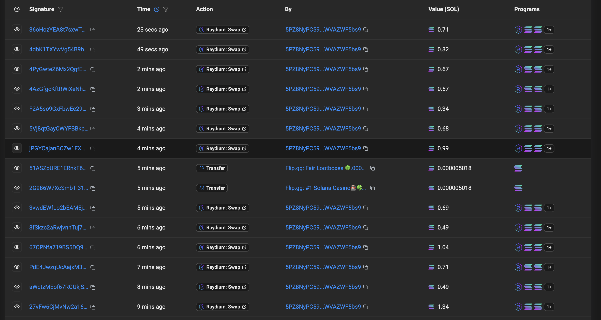

# Solana Wide Sandwich Attack Detector

A Python-based tool for detecting and analyzing wide sandwich attacks on Solana DEXs (Raydium, Orca). This project scans on-chain transactions, identifies multi-slot MEV exploitation patterns, calculates profit extraction, and provides verification tools for blockchain forensics.

## Overview

Wide sandwich attacks are a sophisticated MEV (Maximal Extractable Value) strategy where bots exploit user transactions across multiple slots:
- **Frontrun** (Slot N): Bot buys token, inflating price
- **Victim** (Slot N+1 to N+3): User transaction executes at worse price
- **Backrun** (Slot N+3 to N+8): Bot sells token for profit

Unlike single-slot sandwiches, wide attacks span 2-8 slots, evading basic MEV detectors.

## Features

- **Multi-Block Scanner**: Fetches and parses DEX transactions from 150+ recent Solana blocks
- **Wide Sandwich Detection**: Identifies bot patterns across multiple slots (not just single-slot)
- **Profit Analysis**: Calculates extracted value in SOL with profit percentages
- **Token Swap Parser**: Extracts signer, token pairs, and amounts from transaction metadata
- **Verification Tools**: Generates Solscan URLs for manual on-chain verification

## Requirements

```txt
python-dotenv
solana
asyncio
```

## Installation

1. Clone the repository:
```bash
git clone <repository-url>
cd sandwich
```

2. Install dependencies:
```bash
pip install python-dotenv solana
```

3. Set up environment variables:
```bash
# Create .env file
echo "HELIUS_API_KEY=your_helius_api_key_here" > .env
```

Get a free Helius API key from: https://www.helius.dev/

## Project Structure

```
sandwich/
├── app.py                          # Main application entry point
├── utils.py                        # Block scanning and transaction parsing
├── sandwich.py                     # Wide sandwich detection algorithm
├── pnl.py                          # Profit/loss analysis
├── sandwich_simulate.py            # Simulation generator
├── verification.py                 # Solscan verification report
├── multi_slot_simulation.py        # Multi-slot strategy demonstration
├── config.py                       # DEX program IDs and constants
├── simulate.py                     # Multi-slot simulation (real + hypothetical)
├── simulations.json                # Real wide sandwich simulations
├── dex_transactions.json           # Raw DEX transaction data
├── sandwich_attacks.json           # Detected sandwich patterns
├── profit_analysis.json            # Profitability calculations
└── verification_report.json        # Manual verification checklist


```

## Usage

### 1. Scan Blocks and Detect Sandwiches

```bash
python3 app.py
```

**Output:**
- Scans 150-200 blocks from current slot
- Detects 50+ DEX transactions (Raydium, Orca)
- Identifies wide sandwich patterns
- Calculates profit for each attack
- Saves results to JSON files

**Example Output:**
```
Connected: True
Current slot: 380464130

Total DEX transactions found: 75
Raydium: 43
Orca: 32

Sandwich attacks found: 62
Wide sandwiches (multi-slot): 58
Single-slot sandwiches: 4

Top profitable sandwich:
  Bot: 5PZ8NyPC59bZBaC3rHG1RFubHDjyE9MFAwWVAZWF5bs9
  Profit: 0.1055 SOL (20.12%)
  Slot span: 6 slots
```

### 2. Generate Verification Report

```bash
python3 verification.py
```

**Output:**
- Solscan URLs for each transaction (frontrun, victim, backrun)
- Bot wallet explorer links
- Manual verification checklist
- Saves to `verification_report.json`

**Output:**
- Demonstrates bot strategy across slots
- Shows victim slippage calculation
- Calculates MEV profit extraction
- Explains why multi-slot evades detectors

### 3. Run Multi-Slot Simulation

```bash
python3 simulate.py
```

**Purpose:** Demonstrates bot strategy for wide sandwich attacks across multiple slots (required for assignment simulation component).

**Output:**
- Analyzes real detected wide sandwiches from your dataset
- Shows 3 detailed examples with multi-slot execution
- Generates hypothetical simulation demonstrating bot strategy
- Calculates extracted value per sandwich
- Saves to `simulations.json` and `hypothetical_simulation.json`

## Key Files Explained

### `app.py`
Main orchestrator that:
1. Connects to Solana RPC
2. Scans multiple blocks
3. Detects sandwiches
4. Runs profit analysis
5. Generates reports

### `utils.py`
Core utilities:
- `scan_multiple_blocks()`: Fetches transactions from consecutive slots
- `is_dex_transaction()`: Identifies Raydium/Orca swaps
- `extract_signer()`: Gets wallet address from transaction
- Token balance parser for swap amounts

### `sandwich.py`
Detection algorithm:
- Groups transactions by token pair and slot
- Identifies bot patterns (same signer in frontrun + backrun)
- Validates opposite token directions (buy → sell)
- Calculates slot span for wide vs single-slot classification

### `pnl.py`
Profit calculation:
- Compares SOL in/out for bot transactions
- Calculates net profit and percentages
- Ranks sandwiches by profitability
- Generates summary statistics

### `simulate.py`
Multi-slot simulation:
- Loads real detected wide sandwiches
- Displays 3 detailed examples with slot-by-slot breakdown
- Generates hypothetical scenario showing bot strategy
- Demonstrates why multi-slot execution evades detection
- Calculates victim loss and bot profit

## Results Summary

### Top MEV Bots Identified

1. **5PZ8NyPC59bZBaC3rHG1RFubHDjyE9MFAwWVAZWF5bs9**
   - 4 sandwiches, 0.422 SOL profit

2. **3RMKoab4zynw3fEvDUmfYfnep7nChuMComjjiHKBTFQg**
   - 5 sandwiches, 0.0021 SOL profit

3. **23EfcUag2j2y5t8GXsT9SXYaGS76FyWVWKWkgkiJAh6a**
   - 6 sandwiches, 0.0028 SOL profit

## Verification Process

1. **Automated Detection**: Script identifies patterns
2. **Manual Verification**: Visit Solscan URLs
3. **Cross-Reference**: Check sandwiched.me database
4. **Validation Checklist**:
   - Slot numbers match
   - Bot address consistent
   - Token pairs align
   - Profit calculation verified

### Example Verification

```

Front-run:  https://solscan.io/tx/4XjdNTkreMXH2JBhVY2WFncGZea91dP6jPNcpFLus5XQ7Y2bS48PjXd5Q7hyeJgns1yxZisMuUkR2T1rvNmC8pe7

Victim:     https://solscan.io/tx/2maPAp3vJrrYdEzTLsrayQZMZ1bAKgtP8XeUPRVTnJPiT74wLpvHYAQUpmBie4ovJwNbyNReadcsUgsTMvgWHtqD

Back-run:   https://solscan.io/tx/243aFPMncBctgb8hoCgFNjt76wyCkdf7h9UtTTYbHsv6MGnEsUuevvfQ7wqj3wGAnSsZ3Whdd7WJXGdd19iWWDQb

Bot wallet: https://solscan.io/account/E26WDGhBcUwuYBz5cC6jLvFegFRNW8oG7bbfMhPEBaUi

## Technical Details

### DEX Program IDs

```python
RAYDIUM_PROGRAM_ID = "675kPX9MHTjS2zt1qfr1NYHuzeLXfQM9H24wFSUt1Mp8"
RAYDIUM_CLMM = "CAMMCzo5YL8w4VFF8KVHrK22GGUsp5VTaW7grrKgrWqK"
ORCA_PROGRAM_ID = "whirLbMiicVdio4qvUfM5KAg6Ct8VwpYzGff3uctyCc"
```


### Sandwich Detection Criteria

A valid sandwich requires:
1. Same bot address in frontrun and backrun
2. Different victim address
3. Same token pair traded
4. Opposite swap directions
5. Victim executed between bot transactions
6. Slot span > 0 for wide classification

## Limitations

- Requires Helius RPC (rate limits apply)
- Only detects Raydium and Orca DEXs
- Token balance parsing may fail for complex instructions
- Profit calculation assumes SOL as base token
- Recent transactions may not appear on sandwiched.me yet


## Research References

- Solana MEV dynamics: Jito Labs documentation
- Wide sandwich patterns: @0xGhostLogs Twitter analysis
- sandwiched.me: Real-time MEV tracking
- Helius RPC: Transaction parsing methods

## Contributing

Contributions welcome! Please open an issue or PR for:
- Bug fixes
- New DEX support
- Enhanced detection algorithms
- Documentation improvements

## Disclaimer

This tool is for educational and research purposes only. MEV extraction may be subject to network rules and ethical considerations. Always verify findings through multiple sources before making claims about specific transactions or actors.

## Transactions done by Bot (identified by finding bot address)
